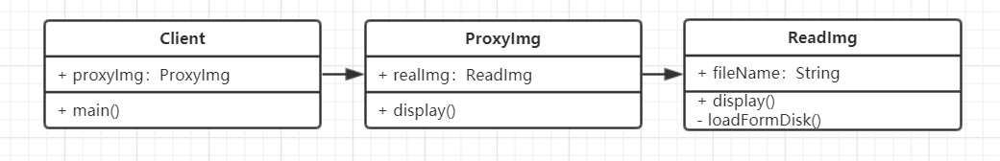

# 代理模式

### 介绍
- 使用者无权访问目标对象
- 中间加代理，通过代理做授权和控制

### UML类图


### 代码演示
```js
class ReadImg {
    constructor(fileName) {
        this.fileName = fileName
        this.loadFromDisk()  // 初始化即从硬盘中加载
    }
    loadFromDisk() {
        console.log('loading...',this.fileName)
    }
    display() {
        console.log('display...',this.fileName)
    }
}

// 代理
class ProxyImg {
    constructor(fileName) {
        this.realImg = new ReadImg(fileName)
    }
    display() {
        this.realImg.display()
    }
}

// Test
let proxyImg = new ProxyImg('1.png')
proxyImg.display()

/*
    Result：
    loading...1.png
    display...1.png
*/
```

### 场景
- 网页事件代理
```js
<div id='div1'>
    <a href='#'>a1</a>
    <a href='#'>a2</a>
    <a href='#'>a3</a>
    <a href='#'>a4</a>
</div>

<script>
    var div1 = document.getElementById('div1')
    div1.addEventListener('click',function(e) {
        var target = e.target
        if(target.nodeName === 'A'){
            alert(target.innerHtml)
        }
    })
</script>
```
- JQuery $.proxy
```js
$('#div1').click(function() {
    // this 符合期望
    $(this).addClass('red')
})
$('#div1').click(function() {
    setTimeout( function() {
        // this 不符合期望
        $(this).addClass('red')
    },1000)
})

// 可以用如下方式解决
$('#div1').click(function() {
    var _this = this 
    setTimeout( function() {
        // this 符合期望
        $(_this).addClass('red')
    },1000)
})

// 也可以通过代理 $.proxy 解决
$('#div1').click(function() {
    setTimeout( $.proxy(function() {
        // this 符合期望
        $(this).addClass('red')
    },this),1000)
})
```
- ES6 Proxy
```js
// 明星 & 经纪人 案例
// 顾客要聘请明星，不能直接与明星接触，而是与明星经纪人接触

// 明星
let star = {
    name: '张三',
    age: 20,
    phone: '13000000000'
}

// 经纪人
let agent = new Proxy( star, {
    get: function(target, key){
        if(key === 'phone'){
            // 返回经纪人自己的手机号
            return '10086'
        }
        if(key === 'price'){
            // 明星自己不报价，由经纪人来报价
            return 120000
        }
        return target[key]
    },
    set: function(target, key, val){
        if(key === 'customPrice){
            if(val < 100000) {
                // 最低 10w
                throw new Error('顾客报价太低')
            }else {
                target[key] = val
                return true
            }
        }
    }
})

// Test
console.log(agent.name)  // 张三
console.log(agent.age) // 20
console.log(agent.phone) // 10086
console.log(agent.price) // 120000

agent.customPrice = 80000 // 抛错
```

### 设计原则验证
代理类和目标类分离，将目标类与使用者隔离开，符合开放封闭原则