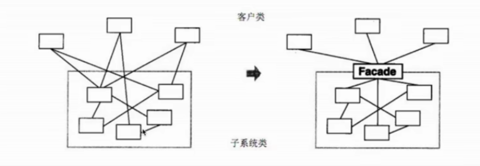
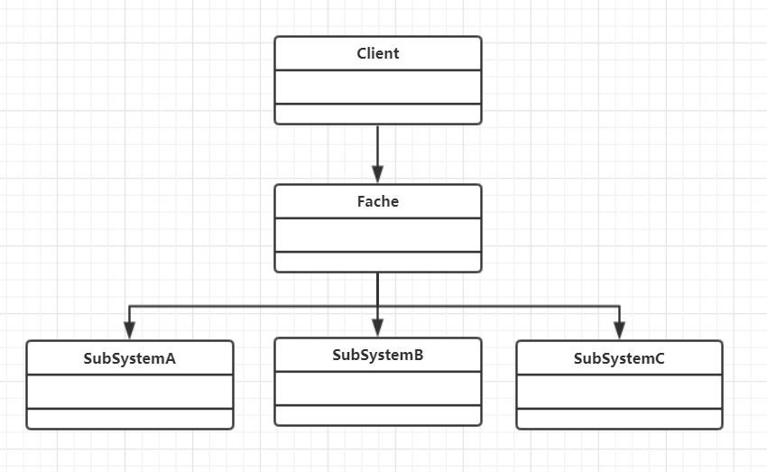

# 外观模式

### 介绍
- 为子系统中的一组接口提供了一个高层接口
- 使用者使用这个高层接口



### 示例
生活中去医院看病，接待员去挂号，门诊，取药

### UML类图


### 场景
```js
function bindEvent(elem, type, selector, fn) {
    // 解决必须传4个参数的情况
    if(fn == null) {
        fn = selector
        selector = null
    }

    // ...
}

// 调用
bindEvent(elem, 'click', '#div1', fn)
bindEvent(elem, 'click', fn)
```

### 设计原则验证
- 不符合单一职责原则和开放封闭原则，因此需要谨慎使用，不可滥用