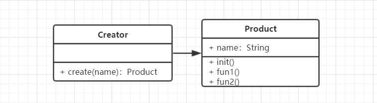

# 工厂模式

### 介绍
- 将`new`操作单独封装
- 遇到`new`的时候就可以考虑是否使用工厂模式

### 示例
- 去购买汉堡的时候，直接点餐，取餐，不需要自己亲手做
- 商店**封装**做汉堡的工作，做好直接给买者

### UML类图


### 代码演示
```
class Product {
    constructor(name) {
        this.name = name
    }
    init() {
        console.log('init')
    }
    fun1() {
        console.log('fun1')
    }
    fun2() {
        console.log('fun2')
    }
}

class Creator {
    create(name) {
        return new Product(name)
    }
}

// Test
let creator = new Creator()
let product = creator.create('product')
product.init()
product.fun1()
product.fun2()
```

### 场景
- Jquery $('div')就是一个工厂
```
// Product
class JQuery {
    constructor(selector) {
            let slice = Array.prototype.slice
            let dom = slice.call(document.querySelectorAll(selector)) // 获取每一个dom元素
            let len = dom ? dom.length : 0
            for (let i = 0; i < len; i++) {
                this[i] = dom[i]
            }
            this.length = len
            this.selector = selector || ''
        }
        // JQuery自身API
    append(node) {
        // TODO
    }
    addClass(name) {
        // TODO
    }
    html(data) {
        // TODO
    }
    // ...
}
// Creator
window.$ = function(selector) {
    return new JQuery
}
```
- React.createElement
```
// Product
class Vnode(tag,attrs,children) {
    // ...
}
// Creator
React.createElement = function(tag, attrs, children) {
    return new Vnode(tag, attrs, children)
}
```
- vue 异步组件
```
Vue异步组件有这样的用法

Vue.component('Component',function(resolve,reject){
    setTimeout(() => {
        resolve({
            template:'<div> I am Component </div>'
        })
    },1000)
})
```


### 设计原则验证
工厂模式中构造函数与创建者分离，通过工厂方法将构造函数与用户隔离开，让用户不能去修改构造函数，符合开放封闭原则