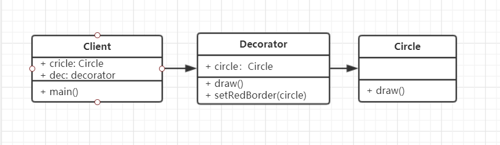

# 装饰器模式

### 介绍
- 为对象添加新功能
- 不改变其原有的结构和功能

与适配器不同，适配器是旧接口已经不能用了，或者说数据，数据格式不能用，所以需要重新设计一个去用，而装饰器模式是原有的功能我们还会继续用，在其基础上再添加功能

### UML类图


### 代码演示
```js
// 被装饰者
class Circle {
    draw() {
        console.log('画一个圆形')
    }
}
// 装饰器
class Decorator {
    constructor(circle) {
        this.circle = circle
    }
    setRedBorder(circle) {
        console.log('设置红色边框')
    }
    draw() {
        this.circle.draw()
        this.setRedBorder(circle)
    }
}

// Test
let circle = new Circle()
circle.draw()

let decorator = new Decorator()
decorator.draw()
```

### 场景
- ES7装饰器
- 第三方库 core-decorators

### ES7 装饰器解析
- 配置环境 
```
npm install babel-plugin-transform-decorators-legacy --save-dev

.babelrc

{
    "presets": [
        "es2015",
        "latest"
    ],
    "plugins": [
        "transform-decorators-legacy"
    ]
}
```
- 装饰类
```js
// 例1：

// 对Demo类进行修饰
@testDec
class Demo {
    // ... 
}

function testDec(target) {
    target.isDec = true
}

console.log(Demo.isDec) // true

// 可以加参数
// 装饰器
function testDec(isDec) {
    return function(target) {
        target.isDec = isDec
    }
}
// Demo - 被装饰者
@testDec(false)
class Demo {

}
console.log(Demo.isDec) // false
```
```js
// 例2： mixin示例

function mixins(...list) {
    return function(target) {
        Object.assign(target.prototype, ...list)
    }
}

const Foo = {
    foo() {
        console.log('foo')
    }
}

@mixins(Foo)
class MyClass {

}

let obj = new MyClass()
obj.foo() // 'foo'
```
- 装饰方法
```js
// 例1:

function readonly(target, name, descriptor) {
    // descriptor 属性描述对象 （ Object.defineProperty中会用到），原来的值如下
    // {
    //     value: specifiedFunction,
    //     enumerable:false,
    //     configurable: true,
    //     writable: true
    // }
    descriptor.writable = false
    return descriptor
}

class Person {
    constructor() {
        this.first = 'A'
        this.last = 'B'
    }

    // 装饰方法
    @readonly   // 将name属性的writable装饰为false
    name() {
        return `${this.first} - ${this.last}`
    }
}

var p = new Person()
console.log(p.name())   // A - B
// p.name = function() {}   // 这里会报错，是因为 name函数被装饰为只读属性
```
```js
// 例2：
function log(target, name, descriptor) {
    var oldValue = descriptor.value

    descriptor.value = function() {
        console.log(`Calling ${name} with`, arguments)
        return oldValue.apply(this,arguments)
    }
    return descriptor
}

class Math {
    // 装饰方法
    @log    // oldValue → add()  经过装饰之后，会先打印日志，然后执行oldValue，也就是add()
    add(a, b) {
        return a + b
    }
}

const math = new Math()
const result = math.add(2, 4)   // 执行add时，会自动打印日志，因为add已经被log装饰器装饰过
console.log(result)

/*
    Result:
    Calling add with Arguments(2) [2, 4, callee: (...), Symbol(Symbol.iterator): ƒ]
    6
*/
```

### core-decorators
- 第三方开源依赖
- 提供常用的装饰器
- 示例
```js
// 首先安装 npm i core-decorators --save

// 开始编码
import { readonly } from 'core-decorators'

class Person {
    @readonly
    name() {
        return 'zhang'
    }
}

let p = new Person()
console.log(p.name())
// p.name = function() {}   // 这里会报错，是因为 name函数被装饰为只读属性
```
```js
// deprecate 执行前有警告提示
import { deprecate } from 'core-decorators'

class Person {
    @deprecate
    facepalm(){}

    @deprecate('We stopped facepalming')
    facepalmHard(){}
}
```


### 设计原则验证
装饰器模式将现有对象和装饰器进行分离，两者是独立存在的，装饰的时候不去修改原有的对象，符合开放封闭原则