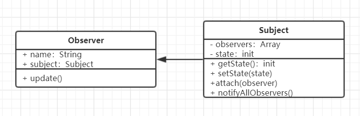

# 观察者模式

### 介绍
- 发布 & 订阅
- 一对多

### 示例
- 点咖啡，点好之后坐等被叫

### UML类图


### 代码演示
```js
// 主题，保存状态，当状态发生变化后，触发所有观察者对象
class Subject {
    constructor() {
        this.state = 0
        this.observers = []
    }
    getState() {
        return this.state
    }
    // 当state发生改变，触发所有观察者
    setState(state) {
        this.state = state
        this.notifyAllObservers()
    }
    // 触发观察者函数
    notifyAllObservers() {
        this.observers.forEach(observer => {
            observers.update()
        })
    }
    attach(observer) {
        this.observers.push(observer)
    }
}

// 观察者
class Observer {
    constructor(name, subject) {
        this.name = name
        this.subject = subject
        this.subject.attach(this)
    }
    update() {
        console.log(`${this.name} update, state is ${this.subject.getState()}`)
    }
}

// Test
let subject = new Subject()
let observer1 = new Observer('observer1',subject)
let observer2 = new Observer('observer2',subject)
let observer3 = new Observer('observer3',subject)
subject.setState(1)

/*
    observer1 update, state is 1
    observer2 update, state is 2
    observer3 update, state is 3
*/
```

### 场景
- 网页事件绑定（先订阅事件，当点击时触发所有订阅好的事件）
```js
<button id='btn1'>btn</button>

<script>
 $('#btn1').click(function(){
     console.log(1)
 })
 $('#btn1').click(function(){
     console.log(2)
 })
 $('#btn1').click(function(){
     console.log(3)
 })
</script>
```
- Promise（Promise中每一个then函数都可以理解为是观察者，先订阅上，但不会立刻执行，然后当Promise状态变化resolved后，才执行）
```js
var src = '/xxx'
var result = loadImg(src) // loadImg 为一个Promise
result.then(function(img){
    console.log('width',img.width)
    return img
}).then(function(img) {
    console.log('height',img.height)
})
```
- jQuery callbacks、
```js
var callbacks = $.Callbacks()   // 注意大小写
// 添加观察者
callbacks.add(function(info) {
    console.log('fn1',info)
})
callbacks.add(function(info) {
    console.log('fn2',info)
})
callbacks.add(function(info) {
    console.log('fn3',info)
})
callbacks.fire('gogogo')  // 所有观察者都会执行

/*
    fn1 gogogo
    fn2 gogogo
    fn3 gogogo
*/
```
- nodeJs 自定义事件
```js
const EventEmitter = require('events').EventEmitter

const emitter1 = new EventEmitter()
emitter1.on('some', () => {
    // 监听 some 事件
    console.log('some event is occured 1')
})
emitter1.on('some', () => {
    // 监听 some 事件
    console.log('some event is occured 2')
})
// 触发 some 事件
emitter1.emit('some')
```
```js
// 继承 EvenEmitter
const EventEmitter = require('event').EventEmitter

// 任何构造函数都可以继承 EvenEmitter 的方法 on emit
class Dog extends EventEmitter {
    constructor(name) {
        super()
        this.name = name
    }
}
var simon = new Dog('simon')
simon.on('bark',function() {
    console.log(this.name, 'barked')
})
setInterval( () => {
    simon.emit('bark')
},1000)
```

### 其他场景
- nodeJs 处理http请求；多进程通讯
- vue / react 组件生命周期触发
- vue watch  （当监听的变量发生改变时，触发watch中绑定的事件，因此watch可以看做是观察者）
```js
var vm = new Vue({
    el:'#app',
    data:{
        firstName: 'Foo',
        lastName: 'Bar',
        fullName: 'Foo Bar'
    },
    watch: {
        firstName: function(val) {
            this.fullName = val + ' ' + this.lastName
        },
        lastName: function(val) {
            this.fullName = this.firstName + ' ' + val
        }
    }
})
```
- vue 双向绑定


### 设计原则验证
主题与观察者分离，不是主动触发而是被动监听，两者解耦，符合开放封闭原则