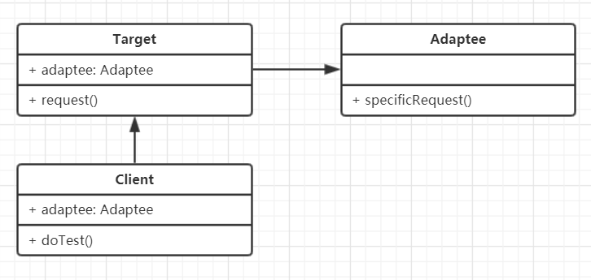

# 适配器模式

### 介绍
- 旧接口格式与现使用者不兼容
- 中间加一个适配来转换接口

通俗来像就有点像我们的数据线转换器

### UML类图


### 代码演示
```
class Adaptee {
    specificRequest() {
        return '标准插头'
    }
}

class Target {
    constructor() {
        this.adaptee = new Adaptee()
    }
    request() {
        let info = this.adaptee.specificRequest
        return `${info} - 转换 → 大号插头`
    }
}
```

### 场景
- 封装旧接口
```
// 自己封装的ajax，使用方法如下
ajax({
    url:'/getData',
    type:'Post',
    dataType:'json',
    data: {
        id:'123'
    }
}).done(() => {

})

// 但因为历史原因，代码都是
$.ajax({
    //...
})

// 即做了一层适配器
var $ = {
    ajax: function(options){
        return ajax(options)
    }
}
```
- Vue computed
```
// 官方computed例子
<div id='example'>
    <p>Original message: "{{message}}"</p>
    <p>Computed reversed message:"{{reversedMessage}}"
</div>


var vm = new Vue({
    el: '#example',
    data: {
        message: 'Hello'
    },
    computed: {
        // 计算属性的 getter
        reversedMessage:function() {
            // this 执行 vm实例
            return this.message.split('').reverse().join('')
        }
    }
})

从模板我们可以知道 我们需要一个普通的message，还需要一个倒序的message

因此data中的message不足以满足我们的需求，我们需要再做处理（封装旧接口思想）

这里computed就相当于一个适配器
```

### 设计原则验证
将旧接口和使用者进行分离，使用者不再操作旧接口，符合开放封闭原则